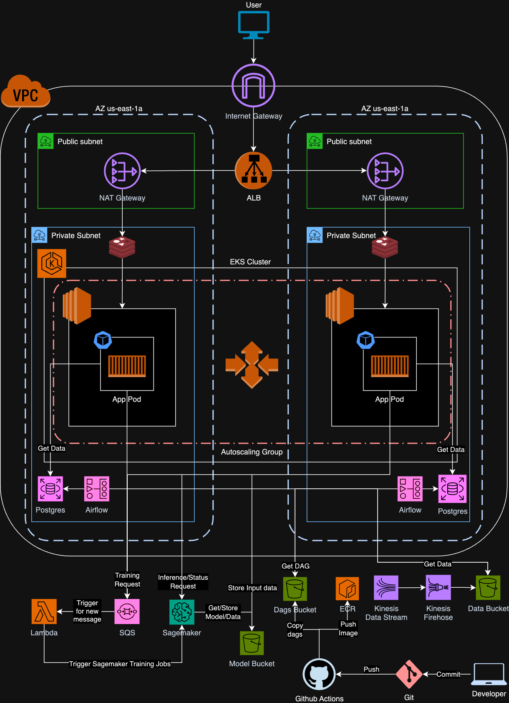

# Telecom-Churn-Prediction

The architecture is designed to handle large volumes of data, ensure low latency, and facilitate both ETL (Extract, Transform, Load) and ML (Machine Learning) pipelines. 

To know more details reagrding the project, kindly refer to this Medium [blog](https://medium.com/@anirudhsridhar1905/data-pipeline-etl-11490accfae3).

## Low Level Design

## High Level Design

