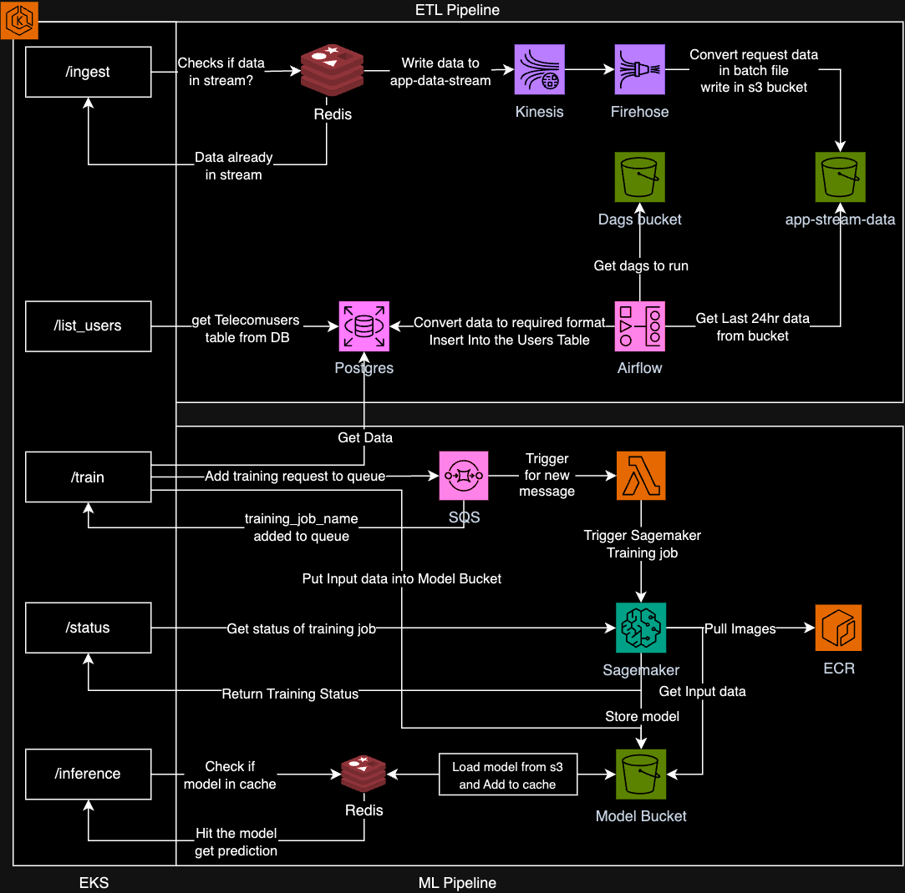

# Data-pipeline-ETL

A scalable ETL system architecture leveraging AWS services like EKS, Kinesis, Airflow, and RDS for efficient data processing and storage.

To know more details reagrding the project, kindly refer to this Medium [blog](https://medium.com/@anirudhsridhar1905/data-pipeline-etl-11490accfae3).

## Low Level Design

## High Level Design

